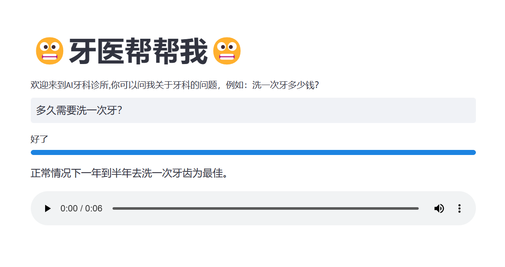
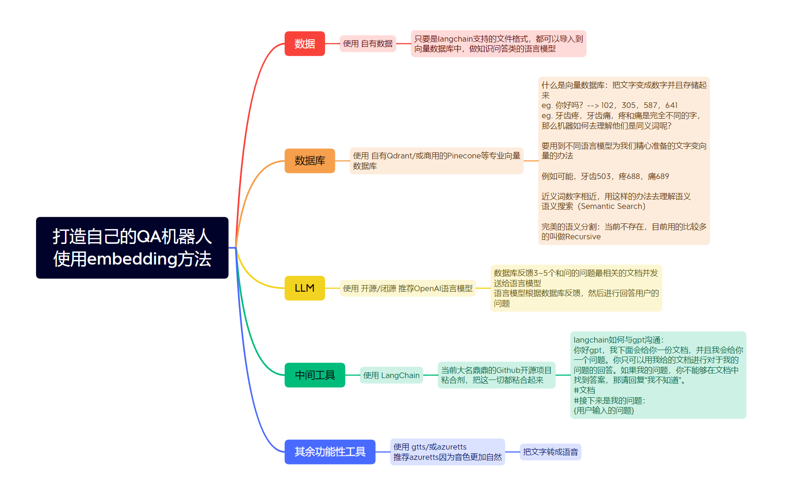

  <a href="./README.md">English</a> |
  <a href="./README_CN.md">简体中文</a>

## Ai Dentist牙科医生
这是一个教学仓库，重要和相关的代码都已经做好了注释，方便伙伴们阅读。

## 创建问答机器人我们需要些什么？

## 使用到的工具或GitHub项目

[LangChain](https://github.com/hwchase17/langchain) 帮助粘合下面的需要用到的各种工具

[Streamlit](https://github.com/streamlit/streamlit) 用来快速创建网站的开源工具

[PineCone](https://www.pinecone.io/) 作为专业的向量数据库

[OpenAi API](https://openai.com/blog/openai-api) 大语言模型帮助我们分析文档以及回答问题

[Google Text To Speech](https://cloud.google.com/text-to-speech/) 帮我们将文字转化成语音

